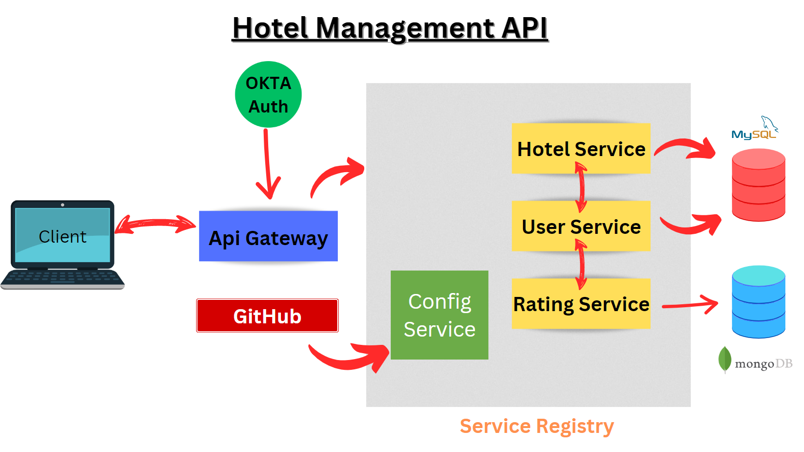

# Hotel-Management-Api
This is an api which basically assists the Hotel-Management. I have made this using spring boot and it follows microservices arcthitecture which is given below.It requires a lot more debugging skills and a lot more patience.It took me arount 3 complete days to understand and build.I am not going to further develop this project.Allmost every services are built using  `SpringBoot version 3.0.7` so keep in mind that version may be changed in future i have not created any `.env` for this because there is no secret things. But i will change the OKTA secrets.Try to use it and have a happy coding experiance.

* Follow me on [LinkedIN](https://www.linkedin.com/in/abhisek-mohanty-3a2241235/)
* Follow me on [Facebook](https://www.facebook.com/abhisek.mohanty.79069/)

## How to use?
1. First run `ServiceRegistry` then run all other microservices.
2. Go to browser and go to `http://localhost:8084/auth/login` then you will get this kind of interface
   
3. Login using okta. If invalid credential will be given you will be redirected to this
  
4. After logging in successfully you will get another interface like this
  

5. Now copy the `accessToken` and use it as oauth2.0 authorization token.
6. Follow the below documentation and access the api.

### Documentation
> This is the current documentation [Postman](https://documenter.getpostman.com/view/23395461/2s93m32NgY)

## Architecture

